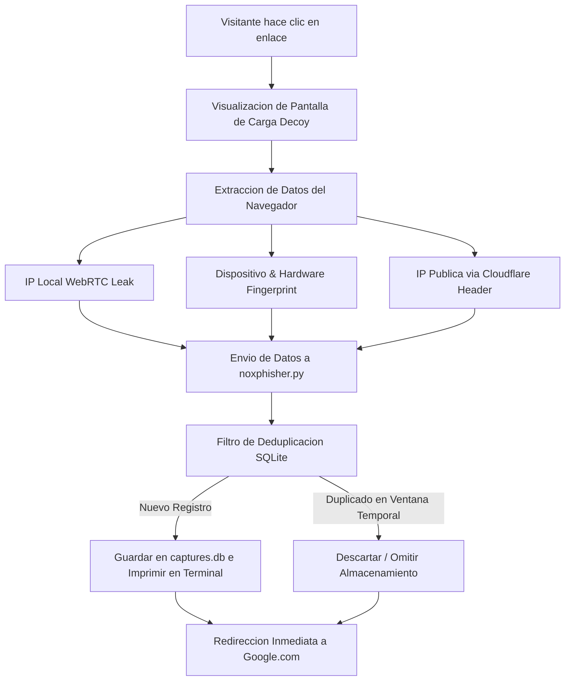

# NoxPhisher

> [!CAUTION]
> **Aviso Legal:** Este software está diseñado EXCLUSIVAMENTE para pruebas de concepto de ingeniería social autorizadas, auditorías internas de seguridad y análisis de privacidad en navegadores. El autor no asume responsabilidad alguna por usos ilícitos, accesos no autorizados o daños causados directa o indirectamente por este código. La utilización en entornos de producción ajenos sin consentimiento expreso está penada por la ley.

> **Auditoría de privacidad y reconocimiento pasivo de visitantes con integración de túneles automatizados**

[](https://www.python.org/)
[](https://www.sqlite.org/)
[](https://developers.cloudflare.com/cloudflare-one/connections/connect-networks/)
[-lightgrey.svg?style=for-the-badge&logo=android)](https://github.com/nostraxiten/NoxPhisher)

---

## Descripcion General

**NoxPhisher** es un framework de reconocimiento pasivo diseñado para auditar la exposicion de datos en navegadores web. Al acceder al enlace generado por la herramienta, el visitante visualiza una pantalla de carga simulada antes de ser redirigido automaticamente a un destino seguro (por defecto, Google). 

Durante este intervalo, la aplicacion recopila informacion de red, localizacion y caracteristicas del hardware a traves de vulnerabilidades conocidas y metodos de extraccion pasiva en el navegador, consolidando toda la informacion en una base de datos local SQLite.

---

## Flujo de Captura y Redireccion

El siguiente diagrama detalla la secuencia de ejecucion desde que el visitante hace clic en el enlace hasta el registro definitivo en la base de datos:



---

## Vectores de Captura Tecnicos

NoxPhisher recopila de forma pasiva los siguientes parametros sin requerir interaccion adicional del usuario:

*   **Identificacion de Red:** 
    *   Direccion IP publica real a traves de la cabecera `CF-Connecting-IP`.
    *   Filtro y deteccion de direcciones locales privadas (IPv4 e IPv6) mediante el protocolo WebRTC (WebRTC leak).
*   **Geolocalizacion Avanzada:** Pais, region, ciudad, coordenadas geograficas precisas (latitud/longitud), Proveedor de Servicios de Internet (ISP) y Sistema Autonomo (ASN).
*   **Huella Digital del Hardware (Fingerprint):** Nombre e identificador del navegador, sistema operativo del host, resolucion de pantalla, memoria RAM disponible y numero de nucleos logicos de la CPU.
*   **Registro de Auditoria:** Marca de tiempo exacta con precision UTC.

---

## Requisitos de Sistema

*   **Entorno:** Python 3.8 o superior.
*   **Dependencia Binaria:** [Cloudflared](https://developers.cloudflare.com/cloudflare-one/connections/connect-networks/downloads/) instalado y accesible desde las variables de entorno del sistema (PATH).
*   **Sistemas Compatibles:** Windows, Distribuciones basadas en Linux o entornos Android utilizando la aplicacion Termux.

---

## Instalacion y Despliegue

### 1. Clonar el repositorio
```bash
git clone https://github.com/nostraxiten/NoxPhisher
cd NoxPhisher
```

### 2. Instalar dependencias necesarias
```bash
pip install -r requirements.txt --break-system-packages
```

> [!NOTE]
> En entornos Linux recientes, puede ser necesario el uso del flag `--break-system-packages` para evitar colisiones con el gestor de paquetes de la distribucion.

---

## Parametros y Opciones de Uso

Para consultar el menu de ayuda en linea:
```bash
python noxphisher.py -h
```

### Tabla de Opciones CLI

| Argumento CLI | Descripcion | Valor por Defecto |
| :--- | :--- | :---: |
| `--qr` | Genera y muestra un codigo QR del enlace del tunel directamente en la terminal. | Desactivado |
| `--window N` | Establece el tiempo en segundos para considerar un registro duplicado (deduplicacion). | `60` |
| `--port N` | Especifica el puerto de escucha del servidor local. | `8080` |
| `--view [N]` | Consulta y muestra en terminal las ultimas N capturas de la base de datos sin iniciar el servidor. | `50` |

### Ejemplos Practicos de Ejecucion

```bash
# Lanzamiento estandar del servidor y tunel
python noxphisher.py

# Iniciar servidor mostrando el codigo QR para dispositivos moviles
python noxphisher.py --qr

# Cambiar el puerto de escucha y configurar una ventana de deduplicacion de 5 minutos (300s)
python noxphisher.py --port 9090 --window 300

# Consultar las ultimas 20 capturas almacenadas en la base de datos local
python noxphisher.py --view 20
```

---

## Estructura del Proyecto

```text
NoxPhisher/
├── noxphisher.py       # Script principal y servidor HTTP
├── requirements.txt    # Listado de librerias Python requeridas
├── captures.db         # Base de datos SQLite (generada automaticamente)
└── grabber_web/
    └── index.html      # Plantilla web servida con los scripts de extraccion
```

---

## Formato del Log de Captura

Cuando se registra una visita valida, el servidor imprime en consola los detalles con el siguiente formato:

```text
======================================================================
CAPTURA #1 [2026-01-01 12:00:00]
======================================================================
  IP Publica:   198.51.100.42 (IPv4)
  IP Privada:   192.168.1.105
  Pais:         Germany
  Region:       Bavaria
  Ciudad:       Munich
  ISP:          Deutsche Telekom AG
  Organizacion: Telekom Deutschland GmbH
  AS:           AS3320 Deutsche Telekom AG
  Coordenadas:  48.1351, 11.5820
  Google Maps:  https://www.google.com/maps?q=48.1351,11.5820
  Navegador:    Firefox
  Idioma:       de-DE
  Pantalla:     1920x1080
  Plataforma:   Win32
  RAM:          16GB
  Nucleos:      8
======================================================================
```

---

## Notas de Implementacion y Detalles Tecnicos

*   **Gestion de Tuneles:** El tunel publico se levanta de forma dinamica llamando al ejecutable `cloudflared` local. No se requiere inicio de sesion ni cuenta previa en la plataforma de Cloudflare.
*   **Logica de Deduplicacion:** Para evitar la saturacion de logs por recargas continuas de la pagina, la herramienta implementa una clave compuesta (IP Publica + Fingerprint). Si una clave ya existe dentro de la ventana de tiempo configurada (`--window`), el registro es descartado de la base de datos.
*   **Integracion con Termux / Notificaciones:** La herramienta utiliza `plyer` para enviar notificaciones nativas en Windows, Linux y macOS. En Termux se recomienda el paquete de API.
