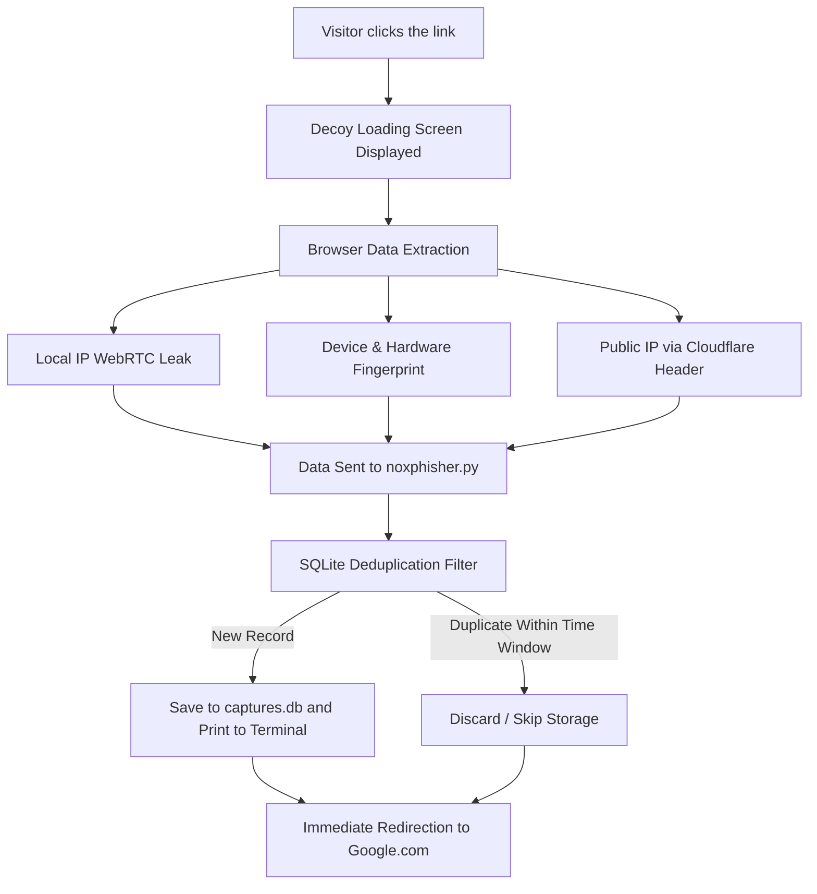

# NoxPhisher

> [!CAUTION]
> **Legal Disclaimer:** This software is designed EXCLUSIVELY for authorized social engineering proof-of-concept testing, internal security audits, and browser privacy analysis. The author assumes no liability for illicit use, unauthorized access, or damages caused directly or indirectly by this code. Use in third-party production environments without express consent is punishable by law.

> **Privacy audit and passive visitor reconnaissance with automated tunnel integration**

[](https://www.python.org/)
[](https://www.sqlite.org/)
[](https://developers.cloudflare.com/cloudflare-one/connections/connect-networks/)
[-lightgrey.svg?style=for-the-badge&logo=android)](https://github.com/nostraxiten/NoxPhisher)

---

## Overview

**NoxPhisher** is a passive reconnaissance framework designed to audit data exposure in web browsers. When a visitor accesses the link generated by the tool, they see a simulated loading screen before being automatically redirected to a safe destination (Google by default).

During this interval, the application collects network, location, and hardware information through known vulnerabilities and passive extraction methods in the browser, consolidating all the information in a local SQLite database.

---

## Capture and Redirection Flow

The following diagram details the execution sequence from the moment the visitor clicks the link to the final record in the database:


```mermaid
graph TD
    A[Visitor clicks the link] --> B[Decoy Loading Screen Displayed]
    B --> C[Browser Data Extraction]
    C --> C1[Local IP WebRTC Leak]
    C --> C2[Device & Hardware Fingerprint]
    C --> C3[Public IP via Cloudflare Header]
    
    C1 & C2 & C3 --> D[Data Sent to noxphisher.py]
    D --> E[SQLite Deduplication Filter]
    
    E -->|New Record| F[Save to captures.db and Print to Terminal]
    E -->|Duplicate Within Time Window| G[Discard / Skip Storage]
    
    F & G --> H[Immediate Redirection to Google.com]
```

---

## Technical Capture Vectors

NoxPhisher passively collects the following parameters without requiring additional user interaction:

*   **Network Identification:**
    *   Real public IP address via the `CF-Connecting-IP` header.
    *   Filtering and detection of private local addresses (IPv4 and IPv6) via the WebRTC protocol (WebRTC leak).
*   **Advanced Geolocation:** Country, region, city, precise geographic coordinates (latitude/longitude), Internet Service Provider (ISP), and Autonomous System (ASN).
*   **Hardware Fingerprint:** Browser name and identifier, host operating system, screen resolution, available RAM, and number of logical CPU cores.
*   **Audit Log:** Exact timestamp with UTC precision.

---

## System Requirements

*   **Environment:** Python 3.8 or higher.
*   **Binary Dependency:** [Cloudflared](https://developers.cloudflare.com/cloudflare-one/connections/connect-networks/downloads/) installed and accessible from the system's environment variables (PATH).
*   **Compatible Systems:** Windows, Linux-based distributions, or Android environments using the Termux app.

---

## Installation and Deployment

### 1. Clone the repository
```bash
git clone https://github.com/nostraxiten/NoxPhisher
cd NoxPhisher
```

### 2. Install required dependencies
```bash
pip install -r requirements.txt --break-system-packages
```

> [!NOTE]
> On recent Linux environments, the `--break-system-packages` flag may be required to avoid conflicts with the distribution's package manager.

---

## Parameters and Usage Options

To view the help menu:
```bash
python noxphisher.py -h
```

### CLI Options Table

| CLI Argument | Description | Default Value |
| :--- | :--- | :---: |
| `--qr` | Generates and displays a QR code for the tunnel link directly in the terminal. | Disabled |
| `--window N` | Sets the time in seconds to consider a record a duplicate (deduplication). | `60` |
| `--port N` | Specifies the local server's listening port. | `8080` |
| `--view [N]` | Queries and displays the last N captures from the database in the terminal without starting the server. | `50` |

### Practical Usage Examples

```bash
# Standard server and tunnel launch
python noxphisher.py

# Start the server showing the QR code for mobile devices
python noxphisher.py --qr

# Change the listening port and set a 5-minute (300s) deduplication window
python noxphisher.py --port 9090 --window 300

# Query the last 20 captures stored in the local database
python noxphisher.py --view 20
```

---

## Project Structure

```text
NoxPhisher/
├── noxphisher.py       # Main script and HTTP server
├── requirements.txt    # List of required Python libraries
├── captures.db         # SQLite database (auto-generated)
└── grabber_web/
    └── index.html      # Web template served with the extraction scripts
```

---

## Capture Log Format

When a valid visit is recorded, the server prints the details to the console in the following format:

```text
======================================================================
CAPTURE #1 [2026-01-01 12:00:00]
======================================================================
  Public IP:    198.51.100.42 (IPv4)
  Private IP:   192.168.1.105
  Country:      Germany
  Region:       Bavaria
  City:         Munich
  ISP:          Deutsche Telekom AG
  Organization: Telekom Deutschland GmbH
  AS:           AS3320 Deutsche Telekom AG
  Coordinates:  48.1351, 11.5820
  Google Maps:  https://www.google.com/maps?q=48.1351,11.5820
  Browser:      Firefox
  Language:     de-DE
  Screen:       1920x1080
  Platform:     Win32
  RAM:          16GB
  Cores:        8
======================================================================
```

---

## Implementation Notes and Technical Details

*   **Tunnel Management:** The public tunnel is dynamically launched by calling the local `cloudflared` executable. No prior login or account on the Cloudflare platform is required.
*   **Deduplication Logic:** To prevent log flooding from continuous page reloads, the tool implements a composite key (Public IP + Fingerprint). If a key already exists within the configured time window (`--window`), the record is discarded from the database.
*   **Termux / Notifications Integration:** The tool uses `plyer` to send native notifications on Windows, Linux, and macOS. On Termux, the API package is recommended.
